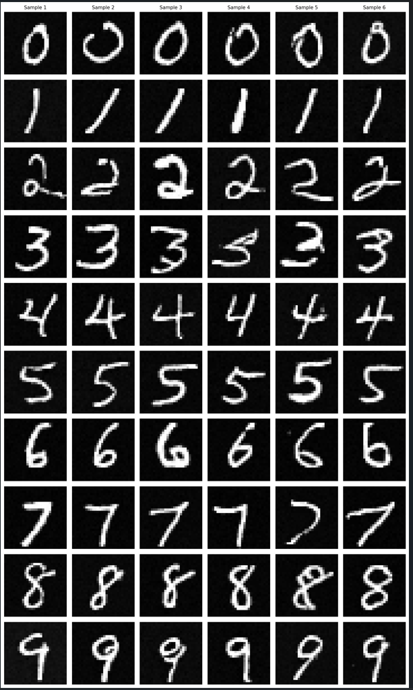

# DDPM_mnist

## Project Introduction
This project implements image generation based on DDPM (Denoising Diffusion Probabilistic Models) and also demonstrates MNIST data generation guided by different classifiers.

## Project Demo
<div align="center">
  
  <br>
  <em>Sample results generated by DDPM on MNIST dataset</em>
</div>

## Code Description
- `train_ddpm.py` - For training the diffusion model
- `train_mnist_classifier.py` - For training the ResNet classifier
- `wekclassifier.py` - For training a simple CNN classifier
- `allcon.py` - For generating images, with options to use either CNN or ResNet classifier for guidance
- `clipcon.py` - For generating images guided by CLIP
- `test_clip.py` - For testing CLIP's classification capabilities on MNIST data

## Project Structure
The specific model architecture code for the diffusion model is located in the `src\diffusion` directory.

The environment configuration file required for all code is `environment.yml`.

## Usage
1. Install the environment:
```bash
conda env create -f environment.yml
conda activate ddpm-mnist
```

2. Train the models:
```bash
python train_ddpm.py
python train_mnist_classifier.py
```

3. Generate images:
```bash
python allcon.py
```
## Reference
This project references the following repository:
- https://github.com/juraam/stable-diffusion-from-scratch/tree/main
